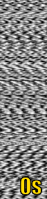

[](https://github.com/fadymedhat/MCLNN/blob/master/LICENSE)

MCLNN: Masked Conditional Neural Networks
========
A neural network model designed for multi-channel temporal signals.
The Masked Conditional Neural Networks (MCLNN) is inspired by spectrograms and the use of filterbanks in signal analysis. It has been evaluated on sound. However, the model is
general enough to be used for any multi-channel temporal signal. This work also introduces the Conditional Neural Networks (CLNN)
inspired by the Conditional Restricted Boltzamann Machine (CRBM). The CLNN is the main structure for the MCLNN operation.

The MCLNN allows inferring the middle frame of a window of frames, in a temporal signal, conditioned on n preceeding and n succeeding frames.
The mask enforces a systematic sparsness that follows a filterbank-like pattern and it automates the mixing-and-matching
between different feature combinations at the input, analgous to the manual hand-crafting of features.


## Getting Started

### Prerequisite

   * Frameworks:
      * CUDA release 7.5, V7.5.17

   * Python (version 2.7.11) environment and packages:
     - Keras 1.0.8
     - Theano 0.8.2
     - memory_profiler 0.52.0
     - numpy 1.9.2
     - scipy 1.0.1
     - h5py 2.8.0
     - matplotlib 2.2.3
     - scikit_learn 0.19.2

   * Hardware requirements (optional):
     - GPU - Nvidia Geforce Titan X
     - Processor - Intel Xeon E5-2640v3 @2.6GHz
     - RAM - 128 GB


   * Sound related:

     * FFmpeg version N-81489-ga37e6dd (built with gcc 5.4.0)
     * librosa 0.4.0
     * muda 0.2.0


## Conditional Neural Networks (CLNN)
The below figure shows a network having two CLNN layers. The CLNN is used as a structure for the MCLNN.


## Masked Conditional Neural Network

The below figure shows the enforced filterbank-like behavior enforced over the weights of a single temporal instance using
a systematic controlled sparsness.


## MCLNN in operation
The below figures shows 30 segments of a spectrogram as an input (left) and their corresponding output (right) from an MCLNN befre applying any activaton function.
The spectrogram shown is a concatenation between a logarithmic 60-bins mel-scalled spectrogram and its delta.

&nbsp;&nbsp;&nbsp;&nbsp;


## Execution requirements

The MCLNN code requires two .hdf5 files, one containing the samples and another of the indices.

#### Samples.hdf5
A single file to hold all the files of a single dataset. Samples are the complete clips (segmentation is
handled within the MCLNN code). Samples are ordered by their category name in ascending order, similarly samples within
a category are ordered by their name.

#### Indices.hdf5
These are primarily 3 files, training, testing and validation. Each of the indices files hold the indices of the samples
following their location in the Samples.hdf5. These files can be generated as many times as the number of cross-validation
operation, i.e. 10-fold cross-validation will have 30 index files generated, where every triple are: training.hdf5
containing 8-folds for training, validation.hdf5 having 1-fold for validation and testing.hdf5 with 1-fold for testing.
Folds are shuffled across the n-fold cross-validation.


Configuration
------------------------------------------
Below are the most important configuration required by the MCLNN categorized into subsections.

#### Files and paths

The parent folder for the  training/validation/testing .hdf5 index files for the n-folds
```
INDEX_PATH = 'parent/path/for/indices'
```

The main .hdf5 file containing the dataset processed samples, e.g. spectrograms.
```
FILE_PATH = 'dataset_processed_files.hdf5'
```

The parent path for the weights stored during training. This is also the same passed used for loading the weights
for a pre-trained model. A folder per fold will be generated in this parent path.
```
ALL_FOLDS_WEIGHTS_PATH = 'parent/path/for/weights'
```
The parent path for images for weights and activations visualization, if any of the visualization flags is enabled
```
VISUALIZATION_PARENT_PATH = 'parent/path/for/visualization'
```

#### Training

The step size specifies the number of overlapping frames between consecutive segments. This number affects the processing
 stage of the segments present in the samples .hdf5 file. It also affects the number of samples that will be available for
training.
```
STEP_SIZE = 1 # overlap between segments is q minus step_size
```

Number of epochs or wait count, will take over to stop the model's training.
```
NB_EPOCH = 2000 # maximum number of epochs
WAIT_COUNT = 50 # early stopping count
```

Track the validation accuracy or loss for the early stopping.
```
STOPPING_CRITERION = 'val_acc'  # 'val_acc' or 'val_loss'
```
Load pretrained model or start training from scratch. If this flag is enabled, pre-trained weights should be present in the
weights parent folder (ALL_FOLDS_WEIGHTS_PATH).
```
USE_PRETRAINED_WEIGHTS = False  # True or False
```


#### Model

Number of classes under consideration
```
NB_CLASSES = 10 # number of classes
```
The names of the classes. These are the names used for the confusion matrix.
```
CLASS_NAMES = ['DB', 'Ra', 'SW', 'BC', 'CT', 'PS', 'He', 'Ch', 'Ro', 'FC']
```

Below are the hyperparameters for each layer of a five layers model.
For each new layer of a deeper model, append its hyperparameters
to the relevant list below. Note: all lists should be equal in length, following the number of layers in a model.
```
DROPOUT = [0.01, 0.5, 0.5, 0.5, 0.1] # dropout at the input of each layer

HIDDEN_NODES_LIST = [300, 200, 100, 100, NB_CLASSES] # hidden nodes for each layer, Note: the last element is the number of classes under consideration.

WEIGHT_INITIALIZATION = ['he_normal', 'he_normal', 'glorot_uniform', 'glorot_uniform', 'glorot_uniform'] # initialization at each layer.
```


The count of MCLNN and Dense layers
```
# Model layers
MCLNN_LAYER_COUNT = 2  # number of MCLNN layers
DENSE_LAYER_COUNT = 2  # number of Dense layers
```


__MCLNN specific hyperparameters__

The order for a two-layered MCLNN. The first MCLNN layer has an order of 17 and the second has an order of 15.
```
LAYERS_ORDER_LIST = [17, 15]  # the order for each layer
```

The Mask Bandwidth of a two-layered MCLNN. The first layer has a bandwithd of 20 and the second layer has a
bandwidth of 5.
```
MASK_BANDWIDTH = [20, 5] # the consecutive features enabled at the input for each layer
```

The Mask Overlap of a two-layred MCLNN. The first layer has an overlap of -5 and the second layer has an overlap of 3.
```
MASK_OVERLAP = [-5, 3] # the overlap of observation between a hidden node and another for each layer
```

The extra frames for the single-dimensional temporal pooling. Note: the middle frame is add to the below value by default.
```
EXTRA_FRAMES = 40  # the k extra frames beyond the middle frame (included by default)
```


#### Visualization


The below flag allows saving the output of the first MCLNN layer of a model during the training stage.
NOTE: this flag is for trial visualization only, it will affect the training. Accordingly, this flag should ALWAYS be disabled
to train a proper model. (This has to do with prediction during training and the Learning_Phase flag used by Keras)
```
SAVE_SEGMENT_PREDICTION_IMAGE_PER_EPOCH = False
```
The indices of the segments to be saved if the SAVE_SEGMENT_PREDICTION_IMAGE_PER_EPOCH flag is enabled.
```
TRAIN_SEGMENT_INDEX = 500 # train segment index to plot during training
TEST_SEGMENT_INDEX = 500 # test segment index to plot during training
VALIDATION_SEGMENT_INDEX = 500 # validation segment index to plot during training
```

The below flag enables segments generation from the test data after training.
```
SAVE_TEST_SEGMENT_PREDICTION_IMAGE = True  # True or False - store prediction images for segments of a specific clip of testing data
```
The start index of the test sample to generate the prediction for, together with the number of segments to generate.
Note: SAVE_TEST_SEGMENT_PREDICTION_IMAGE should to enabled for the below parameters to take effect.
```
SAVE_TEST_SEGMENT_PREDICTION_INITIAL_SEGMENT_INDEX = 50  # first segment to plot. This count is used only if the SAVE_LAYER_OUTPUT_IMAGE is enabled
SAVE_TEST_SEGMENT_PREDICTION_IMAGE_COUNT = 30  # number of segments to save after the first segment. This count is used only if the SAVE_LAYER_OUTPUT_IMAGE is enabled
```
Visualize the weights affecting the hidden nodes at each MCLNN layer. The count specifies the number of hidden nodes to visiualize.
```
HIDDEN_NODES_SLICES_COUNT= 40 # weights visualization for n hidden nodes
```

## Citing the MCLNN
If you are using the MCLNN in your work please cite us as follows:

* If your work involves temporal signals other than sound, or you are using the GTZAN or ISMIR2004 music datasets, then use:
```
Fady Medhat, David Chesmore, John Robinson, "Masked Conditional Neural Networks for Audio Classification."
International Conference on Artificial Neural Networks and Machine Learning – ICANN 2017.
```
