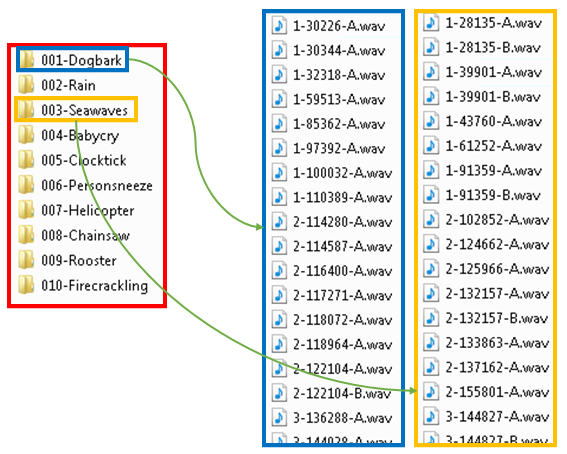
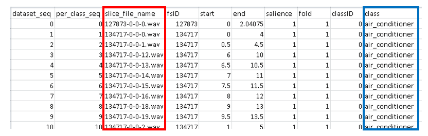

[](https://github.com/fadymedhat/MCLNN/blob/master/LICENSE)

MCLNN dataset transformation
========
The transformation involves the generation of a single file containing the intermediate representation of a signal,
e.g. spectrogram in case of sound. 

The transformer loads each file in order from the dataset, applied the intermediate representation and stores the resulting
transformation to a single hdf5 file (referred later as Dataset.hdf5) for the whole dataset.


## Configuration 

In this section, we will refer to possible scenarios and their corresponding configurations demonstrated over datasets used 
in the experiments as examples for clarification.


#### A balanced dataset without Augmentation

The ESC10 environmental sound dataset:
 * Composed of 400 sound file for 10 environmental categories. 
 * The dataset is balanced, i.e. each category has 40 samples. 
 * The dataset is released into 5-folds. 

Below is the folder structure of the ESC10 dataset. The folders for each sound category are arranged alphabetically
 and similarly for the files within each folder. 
 

 
<p align='center'></p>


```
class ESC10:
    
    # disbale augmentation
    AUGMENTATION_VARIANTS_COUNT = 0
    
    # the original file count for a dataset
    DATASET_ORIGINAL_FILE_COUNT = 400
    
    # this variable adjusts the total count if augmentation is enabled
    TOTAL_EXPECTED_COUNT = DATASET_ORIGINAL_FILE_COUNT + DATASET_ORIGINAL_FILE_COUNT * AUGMENTATION_VARIANTS_COUNT
    
    # the source folder containing the raw files of the dataset
    SRC_PATH = 'I:/dataset-esc10/ESC-10'
    
    # destination path for the single hdf5 containing the whole dataset
    DST_PATH = 'I:/ESC10-for-MCLNN'

    DATASET_NAME = "esc10"
    
    # dataset standard file length = 5 seconds
    DEFAULT_DURATION = "5secs"
    
    # The first frame to extract from the generated spectrogram 
    # at a sampling rate of 22050 sample per second and nfft 1024 overlap 512 > 22050 * 5 sec / 512 = 215 frames
    FIRST_FRAME_IN_SLICE = 4  # to avoid disruptions at the beginning
    
    # the frame count to extract after the first frame to avoid disruptions at the end of the clip
    FRAME_NUM = 200  
   
    # mel-scale filter count
    MEL_FILTERS_COUNT = 60
    
    # width of the nfft window
    FFT_BINS = 1024
    
    # overlapping frames between windows 
    HOP_LENGTH_IN_SAMPLES = 512
    
    # include the 1st derivative between consecutive frames.
    INCLUDE_DELTA = True

    # Number of files to load before starting the transformation
    PROCESSING_BATCH = 10
    
    # Sleep time prevents possible deadlock situations between reading and writing
    SLEEP_TIME = 0
      
```


#### An unbalanced dataset without Augmentation
The Ballroom dataset is another example:
* It is made up of 698 music file 
* Unbalanced in distribution among 8 music genres. 
* There is no specific arrangement or folds defined for the dataset. 

The index generator will handle the shuffling of the samples across the folds during the index generation.
The assigned batch for each fold in this case will be one sample at a time that is iteratively assigned to the folds 
in turn until the samples are consumed.  

``` 	
class BALLROOM:

                        .
                        .
                        .                                                
      
    # enable suffling the samples while being assigned to the folds 
    SHUFFLE_CATEGORY_CLIPS = True
    
    # disable augmentation
    AUGMENTATION_VARIANTS_COUNT = 0
    
                        .
                        .
                        .                                                   
                        
    # samples are assigned one instance at a time
    BATCH_SIZE_PER_FOLD_ASSIGNMENT = 1

```


#### A Balanced dataset with Augmentation

Augmentation is a method to apply certain controlled deformations to the dataset while keeping the properties of the 
original sample to a certain extent. This process enhances the generalization of a model during training.  

This is a different experiment to the ESC10 dataset in which augmentation is applied. In the below listings, we applied 12 augmentation variants for the ESC10 dataset. 

__NOTE:__
 Augmentation is applied on the training data only and the Dataset.hdf5 will include the original and the augmentated
 version, so it is up to the generator to ensure that the training indices include the original and the augmented versions, 
 while constraining the validation and test splits to the original data only. This is carried on for all the folds of the 
 cross-validation operation.

```
class ESC10AUGMENTED:

                        .
                        .
                        .
    
    # shuffling is disabled for the dataset since it is released with predefined splits    
    SHUFFLE_CATEGORY_CLIPS = False
    
    # Augmentation counts applied
    AUGMENTATION_VARIANTS_COUNT = 12
    
                        .
                        .
                        .
    
    # samples assigned for a fold per instance of assignment 
    BATCH_SIZE_PER_FOLD_ASSIGNMENT = 8
    
```    
    
    
#### Loading index from CSV

If the dataset is accompanied with a CSV file, specifiying the samples assignment to folds. Below is a listing for the 
 required configuration.
 
 The below figure shows a chunk of the CSV file released with the Urbansound8k. The file is not exactly the original one,
 but rather a modified version interms of the rows ordering in the csv file without changing the data and the sequenc folder added.
 
 The indices of the three highlighted columns are required for the configuration as shown in the below listing. 
 
<p align='center'></p>
 
 
```

class URBANSOUND8K:

                        .
                        .
                        .

    # shuffling is disabled for the dataset since it is released with predefined splits
    SHUFFLE_CATEGORY_CLIPS = False
    
    # Augmentation is disabled
    AUGMENTATION_VARIANTS_COUNT = 0

                        .
                        .
                        .

    # samples assigned for a fold per instance of assignment
    BATCH_SIZE_PER_FOLD_ASSIGNMENT = 1

    # the name of the CSV file located in the DST_PATH
    CSV_FILE_PATH = os.path.join(DST_PATH, 'UrbanSound8KwithFileSeq.csv')
    
    # csv column index for file sequence - file sequence zero indexed
    COL_FILE_SEQ = 0 
    
    # csv column index for fold id of a file - fold id is 1 indexed
    COL_FOLD_ID = 7 
    
    # csv column index for class id of a file - class id is zero indexed
    COL_CLASS_ID = 8
```